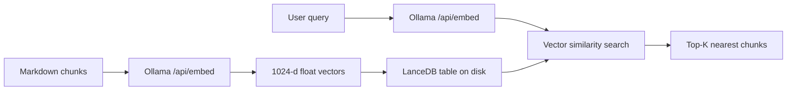

# LanceDB in cue-search

This document describes how [LanceDB](https://lancedb.com/) is used in the `cue-search` sidecar: where data lives on disk, how indexing and search work, and what to watch for when changing embedding models.

## Overview

LanceDB is an **embedded vector database** built on the Lance columnar file format (Apache Arrow–based). Unlike Postgres or a remote vector service, it runs **in-process** and stores data as **files on disk** — no separate database server.

In this project:

- One Python process (`cue-search`) connects via `lancedb.connect()`
- Embeddings are computed **externally** by Ollama; LanceDB only stores and searches vectors
- One table, `note_chunks`, holds one row per markdown section chunk



## Database location

**Default path:**

```
~/Library/Application Support/Cue/search/lancedb
```

On macOS this resolves to something like:

```
/Users/<you>/Library/Application Support/Cue/search/lancedb
```

Configured in `cue_search/config.py`:

```python
lancedb_path: str = "~/Library/Application Support/Cue/search/lancedb"
```

`NoteStore` opens the database here:

```python
self._db = lancedb.connect(str(self.lancedb_dir))
```

**Override** with the environment variable:

```bash
export CUE_SEARCH_LANCEDB_PATH="/some/other/path"
```

Related but separate: indexer state (corpus root + file mtimes) is stored at:

```
~/Library/Application Support/Cue/search/indexer-state.json
```

## Embedding model

LanceDB does **not** embed text in this codebase. Embeddings are produced by **Ollama** via `EmbeddingClient`, which calls `POST /api/embed`.

| Setting | Default | Env var |
|---------|---------|---------|
| Provider | `ollama` | — |
| Base URL | `http://localhost:11434` | `CUE_SEARCH_EMBEDDINGS_BASE_URL` |
| Model | `snowflake-arctic-embed2:latest` | `CUE_SEARCH_EMBEDDINGS_MODEL` |

The chat model used by the search agent (e.g. `gemma4:e4b-mlx`) is **separate** and is not used for vector search.

## On-disk layout

```
~/Library/Application Support/Cue/search/lancedb/
├── __manifest/              # DB-level metadata (table catalog)
└── note_chunks.lance/       # The vector table
    ├── data/                # Columnar data fragments (*.lance files)
    ├── _versions/           # Table version snapshots (manifests)
    └── _transactions/         # Write log (one entry per rebuild)
```

### `data/`

Each `.lance` file is a **columnar fragment**: columns are stored separately for efficient reads. Fragments are appended or replaced on each index rebuild.

### `_versions/` and `_transactions/`

LanceDB is **versioned**. Every full index rebuild (`mode="overwrite"`) writes new data fragments, records a transaction, and publishes a new version manifest. This project always reads the **latest** version; time-travel and rollback are not exposed.

### `__manifest/`

Tracks which tables exist in this LanceDB directory. Currently: `note_chunks` only.

## Table schema

Table name: **`note_chunks`**

| Column | Type | Description |
|--------|------|-------------|
| `id` | string | Unique chunk ID, e.g. `/path/to/note.md:Introduction` |
| `file_path` | string | Absolute path to the markdown file |
| `title` | string | Note title (from frontmatter or inferred) |
| `section` | string | Heading name (`Introduction`, `Body`, etc.) |
| `text` | string | Chunk text used for retrieval |
| `source_url` | string | URL from frontmatter `source:` field |
| `modified_at` | double | File modification time |
| `vector` | `float[1024]` | Embedding from Ollama |

The `vector` column is typed as `fixed_size_list<item: float>[1024]` — every row must have exactly **1024** floats when using `snowflake-arctic-embed2:latest`.

## Indexing flow

Triggered by `cue-search index <corpus>` or `POST /v1/index/rebuild`.

1. Discover all `*.md` files under the corpus root
2. Split each file into sections by markdown headings (`chunking.py`)
3. Embed all chunk texts via Ollama (`embeddings.py`)
4. Write rows to LanceDB; on rebuild, **overwrite** the entire table (`store.py`)
5. Save indexer state to `indexer-state.json`

```python
vectors = self.embedding_client.embed_texts([chunk.text for chunk in chunks])
# ...
self._table = self._db.create_table(TABLE_NAME, data=rows, mode="overwrite")
```

`POST /v1/index/sync` currently performs the same full rebuild (no incremental diff yet).

## Search flow

Triggered by `cue-search query` or `POST /v1/search`.

1. If the table is empty, auto-rebuild the index
2. Embed the user query with the same Ollama model
3. Run vector similarity search against `note_chunks` (default top-K: 8)
4. Pass hits into the agent loop; the agent may call `search_notes` for additional LanceDB lookups

```python
query_vector = self.embedding_client.embed_query(query)
results = self.table.search(query_vector).limit(limit).to_list()
```

## Vector dimension requirements

The query vector and every stored vector **must have the same length**. With the default model, that is **1024 dimensions**.

| Scenario | Outcome |
|----------|---------|
| Same model at index and query time | Works |
| Different model, same dimension | May run but similarity scores are unreliable |
| Different dimension (e.g. 768 vs 1024) | Search fails or errors |
| Changed embedding model without reindexing | Broken or meaningless results |

This codebase does **not** validate dimensions explicitly. It assumes index and query use the same `CUE_SEARCH_EMBEDDINGS_MODEL`.

**If you change the embedding model, rebuild the index:**

```bash
export CUE_SEARCH_EMBEDDINGS_MODEL="some-other-model"
cue-search index "$CORPUS"
```

## Key files in the codebase

| File | Role |
|------|------|
| `cue_search/config.py` | `lancedb_path`, embedding settings |
| `cue_search/store.py` | LanceDB connect, create/overwrite table, vector search |
| `cue_search/embeddings.py` | Ollama `/api/embed` client |
| `cue_search/indexer.py` | Discovers markdown, chunks, triggers store write |
| `cue_search/chunking.py` | Frontmatter parsing, heading-based splitting |

## Operational notes

- **Full overwrite on rebuild** — each reindex replaces the entire `note_chunks` table; there is no per-file incremental update in LanceDB yet.
- **Local only** — data stays on disk under Application Support; no remote LanceDB Cloud connection in v0.
- **Ollama required** — both indexing and search need a running Ollama instance with the embedding model pulled.
